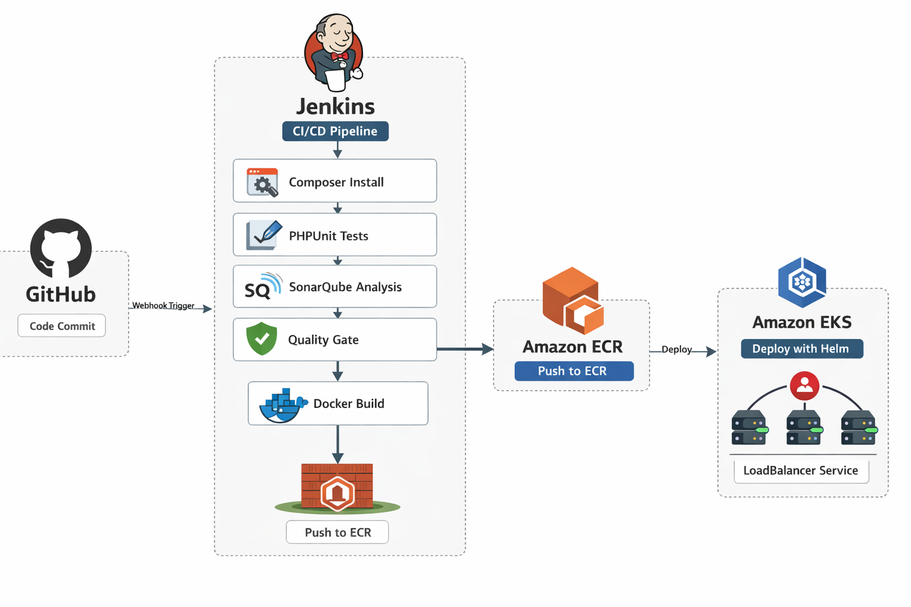

# PHP DevOps CI/CD Pipeline

This project demonstrates a complete CI/CD pipeline for a PHP application using **Jenkins**, **SonarQube**, **Docker**, **Amazon ECR**, **Amazon EKS**, and **Helm**.

The pipeline automates testing, code quality analysis, containerization, and deployment to Kubernetes.




---

## 🚀 Project Overview

This project shows how to build a production-ready CI/CD pipeline for a PHP application.


## 🌐 Watch Demo

Watch this project in action:

[](https://youtu.be/prtCzjSH4dY)


Whenever code is pushed to GitHub, Jenkins automatically triggers the pipeline via webhook and performs the following steps:

1. Checkout source code
2. Install dependencies using Composer
3. Run automated tests using PHPUnit
4. Perform static code analysis with SonarQube
5. Wait for Quality Gate approval
6. Build a Docker image
7. Push the image to Amazon ECR
8. Deploy the application to Amazon EKS using Helm
9. Expose the application using a LoadBalancer

---

## 🧰 Technologies Used

- **PHP** – Application backend
- **Composer** – Dependency management
- **PHPUnit** – Testing framework
- **Jenkins** – CI/CD automation
- **SonarQube** – Code quality & static analysis
- **Docker** – Containerization
- **Amazon ECR** – Container registry
- **Amazon EKS** – Kubernetes cluster
- **Helm** – Kubernetes package manager
- **GitHub** – Source control
- **AWS** – Cloud infrastructure

---

## 📁 Project Structure

```text
php-ci-cd-pipeline/
├── helm/
│   └── php-app/
│       ├── Chart.yaml
│       ├── values.yaml
│       └── templates/
│           ├── deployment.yaml
│           └── service.yaml
└── php-app/
    ├── public/
    ├── src/
    ├── tests/
    ├── composer.json
    ├── Dockerfile
    ├── Jenkinsfile
    └── sonar-project.properties
